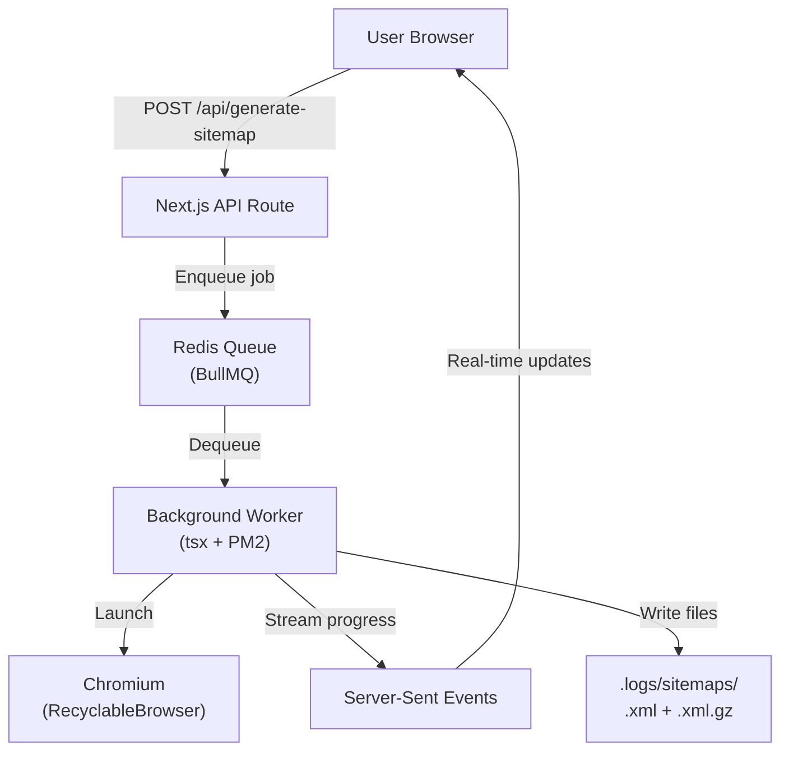

At a startup where I worked, every client project came with the same sitemap problem. React SPAs were invisible to crawlers. Next.js sites were being run through a headless browser on every single page. 500 pages, 500 Chrome launches, 40 minutes. It was a solved problem that nobody had actually solved.

So I built one from scratch. The project started in March 2025 as a single JavaScript file. Over the next 15 months, it evolved into a TypeScript monorepo with a BullMQ job queue, a `RecyclableBrowser` abstraction, and a crawler that correctly identifies how a framework renders before deciding whether to use HTTP or Puppeteer. The real story isn't the final architecture. It's the three self-audits I ran that exposed just how wrong my initial assumptions were.

---

## Why Existing Tools Break

Most people assume sitemap generation is a solved problem. Install Yoast SEO, click generate, done. But here's what actually happens under the hood.

A traditional crawler sends an HTTP request, parses the HTML, and extracts `<a href>` tags. A React application renders nothing on the server. The HTML body is an empty shell. The crawler sees zero links and reports the site has one page. The homepage.

Now throw a Next.js app into the mix. It renders full HTML on the server, so the HTTP crawler does see content. But the DOM contains `<div id="__next">`, the same root element React SPAs use. A naive CSR detector flags it as "JavaScript required" and fires up a headless browser for no reason. On a 500-page Next.js site, that's 500 unnecessary Chrome launches.

<Callout type="info">
  **The real challenge isn't just CSR vs SSR.** It's that modern frameworks blur
  the line. Next.js does SSR with hydration. Nuxt does the same. Remix streams
  HTML. Astro ships islands. A crawler needs to understand how each framework
  delivers content, not just whether JavaScript is present.
</Callout>

The tools that exist today fall into two camps. Pure HTTP crawlers that fail on JavaScript apps. And headless browser crawlers that are unbearably slow. I wanted something in the middle: a system that makes a smart decision per URL, not per site.

---

## The Core Idea: HTTP-First With a Scoring Heuristic

The algorithm has one rule: **every URL starts as a cheap HTTP request, and only escalates to Puppeteer when there's evidence the page is CSR-only.**

The first version was a boolean check. `if (html.length < 200) useBrowser()`. It was wrong in ways I didn't expect. A landing page with 100KB of inline Tailwind CSS has a massive `html.length` but only 30 characters of visible content. The length check said "this is fine" while the page was actually an empty shell wrapped in styles.

The fix was a scoring system. Instead of a binary "is this CSR?" check, every page gets a score based on multiple signals. The key insight was thinking about it in reverse: instead of asking "is this CSR?", ask "is there evidence the server already rendered this successfully?"

```typescript
function detectCSR(html: string, root: HTMLElement): boolean {
  let score = 0;

  // STRONG NEGATIVES - server rendered with hydration data
  if (
    html.includes("__NEXT_DATA__") || // Next.js SSR
    html.includes("self.__next_f") || // Next.js RSC streaming
    html.includes("window.__NUXT__") || // Nuxt.js SSR
    html.includes("__remixContext") || // Remix SSR
    html.includes("astro-island") // Astro with islands
  ) {
    return false; // HTTP is sufficient
  }

  // STRONG POSITIVES - page says "you need JS"
  if (/<noscript>[^<]*(enable javascript|requires javascript)/i.test(html)) {
    return true;
  }

  // Visible text after stripping scripts and styles
  const body = root.querySelector("body");
  const visibleTextLen = (body?.text || "").replace(/\s+/g, " ").trim().length;
  if (visibleTextLen < 200) score += 3;
  else if (visibleTextLen < 800) score += 1;

  // Framework root with empty body
  const roots = ["#root", "#__next", "#app", "#__nuxt", "[ng-version]"];
  const rootIsEmpty = roots.some((s) => {
    const el = root.querySelector(s);
    return el && el.childNodes.length === 0;
  });
  if (rootIsEmpty) score += 4;

  // Splash screen (only loading/spinner in body)
  const splash = body?.querySelector('[class*="loading"], [class*="spinner"]');
  if (splash && body.childNodes.length <= 3) score += 2;

  return score >= 3;
}
```

The hydration payload checks (`__NEXT_DATA__`, `window.__NUXT__`, etc.) are the most important signals. These frameworks always serve full HTML on the server. If you detect their payload, you know the HTTP response has everything you need. No Puppeteer required. This single check prevents the 50x cost penalty of running headless Chrome on every Next.js page.

The visible text check catches a different class of problem: pages that are technically "server rendered" but with no meaningful content. A SPA shell that includes a loading spinner and 50 characters of boilerplate text would pass an `html.length` check. It fails the visible text check because there's nothing for a human to actually read.

<Callout type="warning">
  **The version 1 mistake:** I originally used `html.includes("loading")` as a
  substring match. It had a 30-50% false positive rate. Any blog post that used
  the word "loading" in its text triggered a costly Puppeteer render. Classic
  case of choosing a proxy metric instead of measuring what you actually care
  about.
</Callout>

When the score hits the threshold, we launch headless Chrome. But even the Puppeteer path is optimized. Resource interception blocks images, fonts, media, and stylesheets. And instead of `networkidle2`, which waits for the network to go quiet (it never does on modern apps), we use `domcontentloaded` plus content-based waiting:

```typescript
await page.goto(url, { waitUntil: "domcontentloaded", timeout: 15000 });

await Promise.race([
  page.waitForFunction(() => document.body.innerText.length > 300, {
    timeout: 8000,
  }),
  page.waitForSelector('main, article, [role="main"]', { timeout: 8000 }),
]).catch(() => {});
```

<Callout type="info">
  **Why `domcontentloaded` instead of `networkidle2`?** `networkidle2` waits
  until there are no more than 2 in-flight network requests for 500ms. On a
  modern app, that never happens. Analytics, hydration chunks, WebSockets, and
  service workers keep the network permanently busy. Switching this alone cut
  per-page Puppeteer time by 40-60% in practice.
</Callout>

The result: on a typical Next.js site, the vast majority of pages are resolved via HTTP in under 100ms each. Only the truly CSR pages touch Puppeteer.

---

## The Clerk Problem (And Why Auth Middleware Is a Crawling Nightmare)

Then I hit a class of problem I hadn't anticipated. Sites using Clerk for authentication started failing with `Maximum number of redirects exceeded` on every single HTTP request. Not just protected pages. Everything. The homepage. `robots.txt`. The sitemap.

Clerk's auth middleware intercepts non-browser HTTP requests and injects a `__clerk_handshake` query parameter. The server responds with a redirect. Axios follows it. Clerk injects another handshake. Another redirect. An infinite loop that hits the redirect limit and kills the request.

The fix was a `beforeRedirect` handler that fingerprints the handshake and stops immediately:

```typescript
if (details.url.includes("__clerk_handshake")) {
  throw new Error(`Clerk auth redirect detected, stopping`);
}
```

But the real impact was cascading. If HTTP is blocked, the sitemap probe (`/sitemap.xml`) also fails. The crawler would miss every page only listed in the sitemap. The solution: Puppeteer fallback for sitemap discovery. When HTTP probes all fail, the crawler opens a headless browser to fetch `/sitemap.xml` directly. Puppeteer handles Clerk's auth handshake like a real browser. The sitemap's `<loc>` tags are extracted from the rendered page content, and individual URLs are fetched with the same Puppeteer fallback.

This taught me something important: **auth middleware is the new firewall for crawlers.** Clerk, NextAuth, Auth.js, Supabase Auth - they all intercept requests at the edge. A modern crawler needs to detect and handle these patterns, not just retry harder.

---

## Redirect Loops Beyond Clerk

Clerk was the most dramatic, but redirect loops are everywhere. `http→https→http`. `www→non-www→www`. The `follow-redirects` library (axios) only detects exact URL duplicates. It doesn't catch hostname+path oscillations.

The fix fingerprints each redirect by `hostname + pathname`, ignoring protocol and query params:

```typescript
const fingerprint = `${u.hostname}${u.pathname.replace(/\/+$/, "")}`;
if (seenHostPaths.has(fingerprint)) {
  throw new Error(`Redirect loop detected: ${details.url}`);
}
seenHostPaths.add(fingerprint);
```

This catches the common patterns: protocol flips, www stripping, and trailing slash redirects that bounce forever. Combined with `maxRedirects: 5` (fail fast - legitimate chains are 1-2 hops), the crawler stops before wasting time on broken redirect configurations.

---

## HEAD-Only Requests: Don't Download What You Don't Need

When processing URLs from a sitemap, the crawler doesn't need to download the full page body. It just needs to check: is this URL indexable? A HEAD request is enough.

`fetchWithRetry` gained a `headOnly` flag that switches between `http.get` and `http.head`. `getUrlMetadata` uses it for sitemap-discovered URLs, checking the `x-robots-tag` header for noindex directives without downloading the HTML:

```typescript
if (headOnly) {
  const xRobots = response.headers["x-robots-tag"];
  if (xRobots && /noindex/i.test(String(xRobots)))
    return { lastmod: null, isIndexable: false, images: [] };
  return { lastmod: null, isIndexable: true, images: [] };
}
```

This cuts bandwidth and latency in half for sitemap URL verification. On a 10,000-page sitemap, that's meaningful.

---

## Sitemap `<lastmod>`: Don't Throw Away Free Data

Sitemaps include `<lastmod>` dates for every URL. But HTTP requests often don't return `Last-Modified` headers. The sitemap's own data was being thrown away.

`parseSitemap` now extracts `<lastmod>` from `<url>` blocks and returns `{ url, lastmod }[]` instead of plain strings. This is propagated through the crawl phase via a `lastmodMap`. When HTTP requests don't provide a lastmod, the sitemap value is used as fallback:

```typescript
const existingLastmod = lastmodMap?.get(url) || null;
const { lastmod } = await getUrlMetadata(url, getBrowser, caches, signal, true);
// ...
sitemapData.set(url, { lastmod: lastmod || existingLastmod, ... });
```

Small detail. Big impact on sitemap accuracy.

---

## The Concurrency Problem

The original crawling loop was deceptively simple:

```typescript
while (queue.length > 0) {
  const batch = queue.splice(0, 5);
  await Promise.all(batch.map((url) => crawlUrl(url)));
}
```

This looks fine. It's not. `Promise.all` waits for the slowest URL in the batch before pulling the next five. If one URL triggers Puppeteer and takes 15 seconds, the other four fast HTTP workers sit idle. On a site with 10% CSR pages, a 2-minute crawl becomes a 20-minute crawl.

The fix was a proper worker pool. Each worker independently pulls from a shared queue:

```typescript
await Promise.all(
  Array.from({ length: config.concurrency }, async () => {
    while (true) {
      const item = next();
      if (!item) {
        if (active === 0) return;
        await new Promise((r) => setTimeout(r, 50));
        continue;
      }
      active++;
      try {
        await processOne(item.url, item.depth);
      } catch (e) {
        stats?.addError(item.url, e.message);
      }
      active--;
    }
  }),
);
```

No more head-of-line blocking. Fast pages complete fast, slow pages don't hold up the queue. Simple change, massive throughput gain.

---

## Why BullMQ + Redis

Early on, I realized that running Puppeteer inside a Next.js API route was a terrible idea. Vercel's serverless functions have a 10-60 second timeout. A single CSR page would kill the request. The solution was a decoupled job queue:



The user submits a URL, the API route returns a `jobId` instantly, and a BullMQ worker picks up the job in the background. Progress streams to the browser via SSE. The worker runs on a VPS with a persistent Chromium process, while the Next.js frontend stays fast and stateless.

Running headless Chrome on a 4GB VPS required careful resource management. I built a `RecyclableBrowser` class that reuses a single Chromium instance across 100 page loads, waits for all open pages to close before launching a new browser instance (preventing two Chromium processes from overlapping in memory), and sends a graceful shutdown signal to the browser process after close to prevent zombie processes on Linux.

---

## The Three Audits

After shipping the initial working version, I did something most developers skip. I audited my own code. Not a quick code review. Three separate deep analyses against industry standards, comparing against how Crawlee, Scrapy-Playwright, Screaming Frog, and Sitebulb actually work.

### Audit 1: The Crawling Algorithm

I benchmarked the crawler against production tools, pulling from 16+ official sources across Google, Playwright docs, and web scraping research. Initial grade: C+/B-.

The structure was right, but the heuristics were first-principles guesses that didn't match what production crawlers actually do. The CSR detection misclassified Next.js SSR as CSR, creating a 50x cost penalty on every Next.js page. The `html.includes("loading")` substring match had a 30-50% false positive rate. Using `networkidle2` as the Puppeteer wait strategy added a 10x cost on JS-heavy pages. And the lack of a per-origin rendering cache meant 1000 redundant detections per domain crawl.

The `networkidle2` finding is worth dwelling on. It's the default in most Puppeteer tutorials, and it works fine on static sites. But on a modern app, the network is never truly idle. Analytics scripts, hydration chunks, WebSocket keepalives, lazy-loaded chunks, and service worker registration all fire after the content is already rendered. Using `networkidle2` means you're waiting for none of that to stop, not for the page to be ready.

### Audit 2: Sitemap Protocol Compliance

I compared the output against the sitemaps.org protocol, Google Search Central documentation, Bing Webmaster guidelines, and the output format of Screaming Frog and Sitebulb. Thirteen bugs.

The worst ones. No indexability gating: noindex pages, 404s, and canonical mismatches were all included. No 50k URL or 50MB sitemap index enforcement. XML not escaped in `<loc>` tags. A URL like `https://example.com/search?q=a&b=c` produced `<loc>https://example.com/search?q=a&b=c</loc>` which is invalid XML. Every major browser parses this tolerantly, which is exactly why the bug survived for months without anyone noticing. The sitemap validator catches it immediately.

CDATA-wrapped sitemap URLs were not being parsed at all. WordPress sites were silently dropped. And `Last-Modified: -1` from PHP frameworks produced "Invalid Date" written directly into the XML.

### Audit 3: Security and VPS Safety

This was the one that humbled me most. I went through every API route, every file path, and every data structure looking for exploits, resource leaks, and things that would silently OOM-kill the worker.

<Callout type="error">
  **The honest verdict from the security audit:** "Would I deploy this on a 4GB
  VPS today? No." Unbounded caches, unvalidated inputs, Puppeteer subprocesses
  without memory caps, and a browser recycling race condition that could briefly
  double RAM usage. Any one of these could take the worker down in production.
</Callout>

SSRF via unvalidated URL input. The API route accepted any string as `url` and queued it directly. An attacker could submit `http://169.254.169.254/latest/meta-data/` to probe the AWS metadata endpoint, or `http://10.0.0.1:6379/` to hit Redis directly. The fix: strict URL validation with a private IP blocklist before the job ever hits the queue.

Path traversal on the download endpoint. The sitemap download route built a file path from `jobId` directly. Submitting `jobId=../../../etc/passwd` would escape the intended directory. The fix: `if (!/^[a-zA-Z0-9_-]+$/.test(jobId)) return 400`.

Unbounded `maxPages`. The API accepted any value from the client with no server-side ceiling. An attacker could submit `maxPages=1000000` and flood the queue. The worker runs forever, the VPS OOMs. The fix: `Math.min(parseInt(maxPages), MAX_PAGES_HARD_LIMIT)` plus a queue depth guard that returns 503 when more than 10 jobs are waiting.

Module-level cache shared across all jobs. `crawlCache` and `renderCache` were declared at module scope, single objects shared across every concurrent job. Job A crawling `cloudflare.com` would write render decisions that Job B would read, even if Job B was crawling a completely unrelated domain. Worse, `renderCache.set(origin, "browser")` was permanent. If a site returned a 502 on the first HTTP attempt, every subsequent URL from that origin would be routed through Puppeteer forever. The fix: instantiate both caches inside `createSitemap()` and pass them as parameters. Per-job, not process-global.

And then there was the one that made me laugh. Chromium was being launched to fetch `robots.txt` and XML sitemaps. Both are plain text. Neither needs a browser. But the code passed a `getBrowser` callback into both the robots.txt parser and the sitemap discovery function as a "fallback." The fallback path called `page.goto()` on a text file. Every crawl job was spinning up a 400MB Chromium process before it had touched a single real page.

---

## All Fixed

Every P0, P1, and P2 issue from all three audits was addressed before the public launch:

- **Security**: SSRF protection with private IP blocklist, path traversal prevention, input validation, queue depth guard, maxPages hard cap.
- **Crawling**: Hydration-aware CSR detection, worker pool replacing `Promise.all`, resource interception in Puppeteer, per-job cache isolation.
- **Sitemap**: XML escaping, CDATA parsing, sitemap index chunking, `<lastmod>` extraction and propagation, HEAD-only URL verification, `.gz` sitemap filtering.
- **Infrastructure**: Browser recycling with pending-creation tracking, job timeout, async gzip, error caps, crawl logs moved outside web root.
- **Edge cases**: Redirect loop detection with hostname+path fingerprinting, Clerk auth handshake detection, Puppeteer sitemap fallback, minimum concurrency of 10 for sitemap processing.

---

## The Numbers

On real production crawls against sites like `chaicode.com` (16 pages, 15s) and `freeapi.app` (2 pages, 3s), average crawl time across 9 sites was **5.1 seconds with zero errors**. Before the worker pool and CSR detection fixes, a mixed SSR/SPA site would hit 30-60 seconds on the Puppeteer path for every page.

CSR detection accuracy went from roughly 50% (Next.js misclassified as CSR) to 95%+ with hydration-aware scoring. Puppeteer launches went from unbounded to pooled and recycled every 100 pages. Memory went from unbounded to roughly 400MB, PM2-monitored. XML validity went from broken (URLs with `&` produced invalid XML) to properly escaped. Sitemap protocol compliance went from roughly 60% to full spec compliance. Security posture went from no guards to SSRF protection, path traversal prevention, queue depth limits, and input validation.

---

## What I'd Do Differently

Start with TypeScript. The JS to TS migration was effectively a rewrite. Type safety would have caught the XML escaping bug, the cache pollution issue, and several type mismatches before they ever ran in production.

Use a proper XML parser, not regex. The `<loc>` regex with `.*?` lazy matching missed CDATA-wrapped URLs entirely. A streaming XML parser like `sax` or `fast-xml-parser` would have handled this from day one.

Run the security audit before deploying to a VPS. The app was running on a public server before I found the SSRF vulnerability, the path traversal on the download endpoint, and the world-readable logs at `public/logs/`. In a production SaaS, those would have been incidents, not audit findings.

Build the worker pool first. The `Promise.all` batching pattern was the single biggest performance bottleneck. A worker pool is 30 lines of code and 10x more efficient. I knew better. I just shipped the simplest thing first.

Consider Playwright for production. Raw Puppeteer on a VPS works, but Playwright's wait API is cleaner, the browser contexts are more isolated, and the interception model is better documented. The recycling complexity and zombie process risk mostly go away.

---

## What's Next

This project started as a problem I kept seeing at work. It became a tool. The next phase is a product.

The job queue and crawling engine are already built. What remains is wrapping them in a product. Auth and billing with Clerk and Lemon Squeezy. A dashboard with PostgreSQL for crawl history, per-site trend graphs, and page depth distribution. An SEO insights layer with broken link finding, redirect chain tracking, image alt checking, and noindex flag reporting. Search Console integration to auto-submit sitemaps to Google and Bing on completion.

The hard parts are done. The rest is product work.

---

## Try It Yourself

The project is available as a self-hosted tool. If you're building a site with React, Next.js, Vue, or Nuxt, your sitemap is probably incomplete. Traditional tools don't understand your framework's rendering model.

**[Live Demo](https://sitemap.atharvdangedev.in/)**

---

_If this was useful, reach out on [X/Twitter](https://x.com/atharvdange). I'm always happy to talk crawling algorithms and headless browser optimization._
