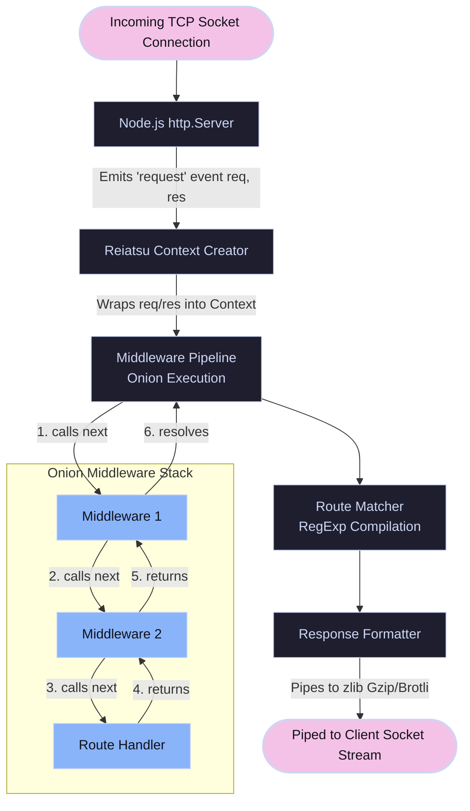

Reiatsu is a zero-dependency, type-safe HTTP server framework for Node.js, built entirely from first principles using only Node.js core modules.

By eliminating reliance on bloated framework stacks (such as Express, Fastify, or Koa), this project implements its own high-performance routing algorithm, async middleware pipeline, request/response context abstractions, input validation suite, and security headers layer directly on top of Node's native `http` module.

---

## The Challenge

Building an HTTP framework in Node.js from first principles means bypassing standard abstractions and interfacing directly with Node.js's low-level TCP/HTTP wrapper. The core `http` module provides only basic request and response event listeners.

Developers are left to solve complex infrastructure needs manually:

- **Low-Level Streams**: Request bodies are streams. Reading JSON payload bodies requires manually accumulating buffer chunks, handling character encoding, and parsing exceptions.
- **Dynamic Parameterized Routing**: Node.js does not have a router. Matching dynamic paths (e.g., `/users/:id/posts/:postId`) and resolving wildcards requires a fast pattern-matching routing engine.
- **Strict Compile-Time Type Safety**: Inferring route parameters at compile time from a path string literal (so that typing `ctx.params.id` is fully checked by the TypeScript compiler) is exceptionally difficult.
- **Asynchronous Execution Chaining**: Middlewares must execute in sequence, support asynchronous operations, allow global error handling, and support graceful connection shutdown.

**My Role:** I was the sole developer and architect for this project, designing the framework core, writing the router and middleware composer, publishing the package to npm, and maintaining full type safety throughout.

---

## The Solution

Reiatsu packs production-grade infrastructure features into a zero-dependency package, establishing a robust HTTP server architecture with a developer experience similar to modern frameworks.

### Core Features

- **Zero-Dependency Security**: Crafted entirely using native Node.js core modules (`http`, `zlib`, `crypto`), eliminating supply-chain vulnerabilities and keeping bundle size minimal.
- **Dynamic Route Inference**: Features a compile-time type-safety engine that parses route parameters from path templates, guaranteeing that parameter access is type-checked at build time.
- **Asynchronous Middleware Composer**: Supports stack composition and asynchronous routing chains, utilizing an onion-model pipeline execution to wrap requests in unified error boundary structures.
- **Built-in Security & Utilities**: Ships with a fixed-window rate limiter, CORS preflight engines, CSRF token validation, security header injections (HSTS, CSP), HTML escaping utilities, and Brotli compression.

---

### Quick Start / Developer Experience

Reiatsu keeps boilerplate minimal while remaining fully type-safe out of the box:

```typescript
import { router, serve } from "reiatsu";

// Parameters are automatically inferred and type-checked!
router.get("/users/:userId/posts/:postId", (ctx) => {
  const { userId, postId } = ctx.params;
  ctx.json({ userId, postId });
});

serve(3000);
```

## Technical Architecture

Reiatsu intercepts incoming raw Node.js request and response streams, compiles them into a unified context, dispatches them through a middleware stack, matches the route, and streams the compiled output:



---

## Engineering Deep Dives

### 1. Type-Safe Route Parameter Inference

Traditional Node frameworks require manual typing for route parameters, which is prone to runtime errors. Reiatsu solves this by implementing recursive template literal types to parse route paths at compile-time:

```typescript
// Route parameter extraction engine
export type ExtractRouteParams<Path extends string> = Path extends `/${infer P}`
  ? ExtractRouteParams<P>
  : Path extends `${infer P}/`
    ? ExtractRouteParams<P>
    : ExtractParamsFromPathSegments<Path, {}>;

type ExtractParamsFromPathSegments<
  PathSegment extends string,
  Acc extends Record<string, string>,
> = PathSegment extends `${infer Segment}/${infer Rest}`
  ? ExtractParamsFromPathSegments<
      Rest,
      Acc & ExtractParamOrWildcardFromSegment<Segment>
    >
  : Acc & ExtractParamOrWildcardFromSegment<PathSegment>;

type ExtractParamOrWildcardFromSegment<Segment extends string> =
  Segment extends `*`
    ? { wildcard: string }
    : Segment extends `:${infer ParamName extends string}(${infer _Regex})`
      ? { [K in ParamName]: string }
      : Segment extends `:${infer ParamName extends string}`
        ? { [K in ParamName]: string }
        : {};
```

When a user defines a route like `/posts/:postId/comments/:commentId` or `/user/:id(\\d+)`, the compiler dissects the string literal, identifies dynamic parameter segments (including regex constraints and trailing wildcards), and automatically compiles the parameters into a type-checked shape.

This guarantees full autocomplete and compile-time verification when accessing parameters:

```typescript
router.get("/posts/:postId/comments/:commentId", (ctx) => {
  const { postId, commentId } = ctx.params; // Fully autocompleted & type-checked!
});
```

### 2. Asynchronous Middleware Onion Composer

To support modular request interception, Reiatsu implements an onion-model middleware compositor. Each middleware function receives the request `Context` and a `next` callback, allowing it to perform tasks before and after subsequent layers:

```typescript
export function compose(...middlewares: Middleware[]): Middleware {
  if (middlewares.length === 0) {
    return async (ctx, next) => await next();
  }

  if (middlewares.length === 1) {
    return middlewares[0];
  }

  return async (ctx, next) => {
    let index = -1;

    const dispatch = async (i: number): Promise<void> => {
      if (i <= index) {
        throw new Error("next() called multiple times");
      }

      index = i;
      const fn = i === middlewares.length ? next : middlewares[i];

      if (!fn) return;

      await fn(ctx, () => dispatch(i + 1));
    };

    await dispatch(0);
  };
}
```

This async compose function resolves each middleware using clean `async/await` execution chains, with optimized fast-paths for empty or single middleware lists. It allows features like our global `errorHandlerMiddleware` to catch exceptions thrown deep inside child handlers by simply awaiting the `next()` execution call.

### 3. Stream-Based Response Processing & Brotli Compression

Loading large files into memory before sending them over the network creates memory bottlenecks. Reiatsu relies heavily on Node.js streams to maintain constant memory consumption regardless of response payload size:

```typescript
// Memory-efficient response streaming inside Context
streamFile(
  filePath: string,
  options?: {
    contentType?: string;
    disposition?: "inline" | "attachment";
  }
) {
  const stream = createReadStream(filePath);
  const contentType = options?.contentType || getMimeType(filePath);

  this.stream(stream, {
    ...options,
    contentType,
    filename: basename(filePath),
  });
}
```

By piping the file read stream directly into Node's raw HTTP socket write stream (`this.res`), data chunks are sent to the network immediately as they are read from disk. For JSON and text-based payloads, we buffer responses to ensure error boundary safety, compressing them on-the-fly using gzip or Brotli stream pipes before sending them to optimize network utilization.

This is achieved by intercepting the standard `res.write` and `res.end` calls inside the compression middleware, capturing response chunks, and dynamically piping them into a Brotli or Gzip compressor stream when appropriate:

```typescript
// Excerpt from src/middleware/compression.ts
export const createCompressionMiddleware = (
  options: CompressionOptions = {},
): Middleware => {
  return async (ctx, next) => {
    const acceptEncoding = ctx.req.headers["accept-encoding"] || "";
    const originalWrite = ctx.res.write.bind(ctx.res);
    const originalEnd = ctx.res.end.bind(ctx.res);
    let chunks: Buffer[] = [];

    // Intercept write calls to buffer response data
    ctx.res.write = (chunk: any) => {
      if (chunk)
        chunks.push(Buffer.isBuffer(chunk) ? chunk : Buffer.from(chunk));
      return true;
    };

    ctx.res.end = (chunk?: any) => {
      if (chunk)
        chunks.push(Buffer.isBuffer(chunk) ? chunk : Buffer.from(chunk));
      const buffer = Buffer.concat(chunks);

      // Compress using Brotli if supported by browser/client
      if (preferBrotli && acceptEncoding.includes("br")) {
        ctx.res.setHeader("Content-Encoding", "br");
        ctx.res.removeHeader("Content-Length");
        const br = createBrotliCompress();

        ctx.res.write = originalWrite;
        ctx.res.end = originalEnd;
        br.pipe(ctx.res);
        br.end(buffer);
      } else {
        /* Fallback to gzip or raw transmission */
        ctx.res.write = originalWrite;
        ctx.res.end = originalEnd;
        originalEnd(buffer);
      }
    };
    await next();
  };
};
```

---

## Technical Challenges & Trade-offs

### 1. Zero-Dependency Footprint vs. Development Time

Avoiding third-party libraries (like `path-to-regexp`, `mime-types`, or `cookie`) meant writing custom utility parsers from scratch.

- **Decision**: I built custom parsers for query strings, dynamic URL parameter regex extraction, cookie serialization, and HTML escaping. Although this increased initial engineering effort, it resulted in a lightweight package, eliminated dependency audit issues, and achieved high runtime performance due to single-purpose design.

### 2. Regex-Based Route Parsing vs. Radix Trees

Radix tree routing is highly efficient for heavy route structures, but dynamic parameters and wildcards require complex state management.

- **Decision**: Reiatsu compiles route path strings into named-capture-group regular expressions during initialization. For average applications (under 100 routes), regular expression execution is fast and easy to maintain while enabling complex matching rules.

### 3. Error Boundary Safety vs. Stream Interruption

In Node.js HTTP, once headers or body chunks are sent to the client, the HTTP status code cannot be modified. If an exception occurs mid-stream inside a handler, a standard global error middleware cannot return a `500 Internal Server Error` page.

- **Decision**: We designed a double-phase response buffer. Normal JSON responses are accumulated and sent atomically, allowing the middleware stack to intercept errors and return proper error responses. Large files and media bypass this buffer and pipe directly, handling mid-stream failures by immediately closing the socket connections cleanly to flag the network fault.

---

## Results & Impact

- **Zero-Dependency Security Model**: Achieved a 100% dependency-free NPM package, eliminating third-party security vulnerabilities and supply-chain vectors.
- **Compile-Time Safety**: Shipped compile-time route parameter validations, preventing parameter runtime undefined crashes.
- **Lightweight Footprint**: Generated a package payload under 45KB (compared to Express's megabyte-scale folder footprint), making it ideal for edge deployments.
- **NPM Package Release**: Published as `reiatsu` on the npm registry, featuring complete TypeScript declaration files, built-in CORS configurations, and rate-limiting modules.
